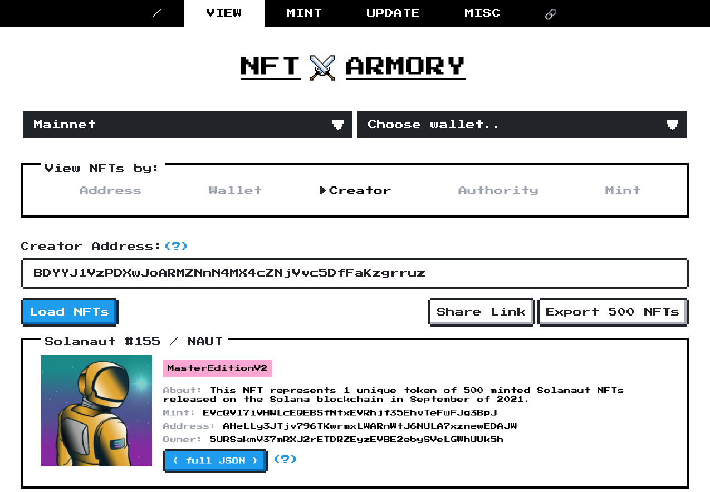
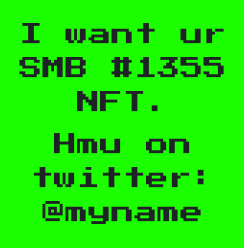

# NFT Armory ⚔️
[](https://app.netlify.com/sites/sharp-euclid-d77d5a/deploys)

You can access a live version at www.nftarmory.me.

# What is it


NFT Armory was imagined as the developer's / artist's best friend for experimenting with Metaplex NFTs on Solana.

It lets you:
- `View NFTs`
  - by owner / creator / authority / mint
    - eg enter `9BKWqDHfHZh9j39xakYVMdr6hXmCLHH5VfCpeq2idU9L` to get all 10k degen apes
  - get NFT metadata as JSON
  - export NFTs as Zip
    - yes all 10k at aonce
  - easily share a link to all NFTs by a specific owner / creator / authority, or a single speific NFT
  - 💎 BONUS: when searching by `Creator` or by `Update Authority`, you get automatic rarity scores / ranking / categories! 💎 
- `Mint new NFTs`
  - Master editions / Prints
- `Update NFTs`
  - update metadata / authority / whether the primary sale happened
- `Sign Metadata`
- `Create Metadata PDAs`
- `Create Master Edition PDAs`
- `I WANT UR NFT`
  - lets you send someone an NFT that looks like the below, in the hope that they contact you back. Useful if you want to buy an NFT from someone but don't know who they are.



A few other notes:
- Works on mainnet / devnet / testnet / localnet
- Works with phantom / sollet / solflare
- Pulling large quantities of NFTs on mainnet can take a bit of time. Worst I've seen is ~5min for 10k NFTs
- There are no rate limits on mainnet (private node) - but there are limits on devnet / testnet (public node)

# Why build it
1) Sounded fun ¯\_(ツ)_/¯
2) I badly wanted a graphical UI to quickly experiment with / iterate on NFTs, and couldn't find any
3) To help grow and foster the Solana NFT / Metaplex community 💪
4) 42

# Play with it
You can try entering the following addresses to ge a feel for the tool:

Viewing
- Creators:
  - Solanauts creator: `BDYYJ1VzPDXwJoARMZNnN4MX4cZNjVvc5DfFaKzgrruz` (500)
  - Aurory creator: `9vwYtcJsH1MskNaixcjgNBnvBDkTBhyg25umod1rgMQL` (10k)
  - Degen ape creator: `9BKWqDHfHZh9j39xakYVMdr6hXmCLHH5VfCpeq2idU9L` (10k)
  - Sneks creator: `AuTF3kgAyBzsfjGcNABTSzzXK4bVcZcyZJtpCrayxoVp` (10k)
  - Thugbirds creator: `AvkbtawpmMSy571f71WsWEn41ATHg5iHw27LoYJdk8QA`
  - Geckos creator: `FEg3mmpcrcRsVTuc2n3oghHpRvAtEJJau4KWjaPpLKcA`
  - Boryoku Dragonz creator: `DRGNjvBvnXNiQz9dTppGk1tAsVxtJsvhEmojEfBU3ezf`
  - The Tower creator: `6PTSaVPGLzzgAqw9veQUVKhW2ggsEaV5ghBeLsQn2GVN`
  - SMB creator: `9uBX3ASjxWvNBAD1xjbVaKA74mWGZys3RGSF7DdeDD3F`
  - Frakt creator: `6wPYbuGRXZjVw2tCeTxwRiQU7AzFDTeFEKuUFpJZpcix` 
- Authorities (sometimes the same as creators, but not always):
  - Playground waves authority: `Edy3xedybSQYAE6eboza5YEcoJan91nfSd3jUppHz7u1`
- Mints:
  - Something special: `A3wpue1mWdnfiU7VVLQeMAuVR4LcVrEsTtxysX1hPKLZ`
  - Go on https://digitaleyes.market/, click any NFT you like, and you'll find "Mint ID" in the bottom left-hand corner. Copy that into the mint field:)
    - Btw you can also find more creators / authorities this way. Once you paste the Mint ID and get back the full NFT, you'll get all the metadata. Open it up and look for creators / update authority in there.

Minting
- Use this URI to mint test NFTs: https://gateway.pinata.cloud/ipfs/Qmawjub6LNBQUZ9KnVLMobf3bUiKwjusKpb52p86k5SAZG
- I've left plenty of tooltips / hints around the app that should help you figure out what to put where

# Deploy your own version
The entire app is open source, so you can deploy locally and it should just work. Follow these steps:

Install the dependencies: 💽
```
yarn install
```
Launch in dev mode: ⚒️
```
yarn serve
```
Build for prod: 🚀
```
yarn build
```

Note you'll need to have [vue-cli](https://cli.vuejs.org/guide/installation.html) installed.

# Run in Docker
The Docker image supports these environment variable for configuration:

- PORT: the port to run the web server on, default: 3000
- NF_FILE: name of the custom 404 file, default: 404.html
- IDX_FILE: name of the custom index files, default: index.html
- TLS_CERT_FILE: TLS certification file, optional, required for HTTPS support
- TLS_KEY_FILE: TLS key file, optional, required for HTTPS support

Run with default configs:
```bash
$ docker pull gyengus/nft-armory
$ docker run -d -p 8080:3000 nft-armory
```
You can also use docker compose:
```bash
$ docker-compose up -d
```


# License
MIT

# Feedback & Contributions
If you find stuff that's missing that you wish was there - please [let me know](https://twitter.com/_ilmoi) 🙏 I'll keep working on the app as I venture through Solana NFT land:)

Otherwise feel free to PR directly. Contributions always welcome.
